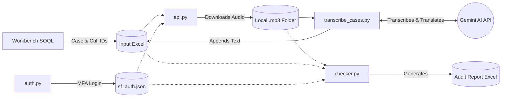

# Salesforce Call Audio Downloader & Transcriber

This repository contains an automated data processing pipeline designed to interact with Salesforce. It authenticates, downloads call recordings associated with specific cases, verifies the downloads, and transcribes the audio using Gemini AI.

## 🎯 The End Goal
To create a fully automated, zero-touch pipeline that transforms locked away, multi-lingual Salesforce audio recordings into a structured, easily searchable, and fully audited English text database. This enables rapid analysis of customer interactions without requiring manual downloading, listening, or manual translation.

## 💡 What it is Used For
* **Quality Assurance & Compliance:** Automatically pulling random samples of calls for auditing and ensuring agents are following proper procedures.
* **Process Automation:** Eliminating the tedious, manual process of clicking through Salesforce to find, play, and save individual audio files.

---

## 📊 How It Works (System Architecture)

## 🛠 Setup & Prerequisites
* Python 3.x
* Playwright (`pip install playwright` followed by `playwright install`)
* Required Python packages (e.g., `pandas`, `requests`, Gemini SDK)
* A valid Gemini API Key

## 🚀 Usage

**Important Note on Data Extraction:** The initial Call IDs and Case IDs used as inputs for this pipeline must be extracted using **Workbench SOQL queries** directly from Salesforce and saved into your input Excel file.

1. Run `auth.py` to authenticate and create your session token. *(Wait for MFA prompt on your device)*.
2. Ensure your input Excel file with Case/Call IDs is in the root directory.
3. Run `api.py` to fetch and download the audio.
4. Run `checker.py` to verify all files were downloaded successfully.
5. Run `transcribe_cases.py` to process the audio and append transcripts to your Excel file.
